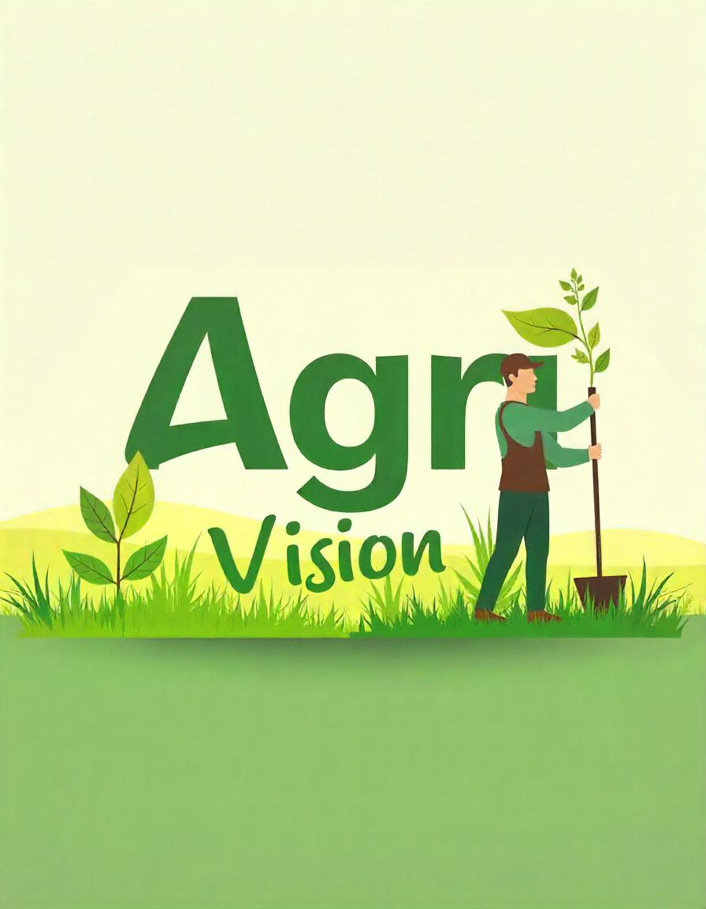

<h1 align="center">AgriVision - Reforming Agri Living <br /></h1>  
<p align="center">
  
</p>

# MINI PROJECT using MERN 
## 🌱Agricultural Web Application Project Built with Reactjs + Expressjs + Nodejs


# The purpose of Agri Vision Project is to provide connections between different roles in the agriculture industry. As the farmers are not getting a fair price for their goods because of contractors. This app removes the requirement of contractors for farmers. Farmers can buy their required needs for farming from Sellers and they can also sell their products to the Consumers


## Features

# Admin
- Manages overall web application  

# Farmer Profile
- Add/Delete Grains
- Edit Profile
- Add/Edit Address
- Buy Seeds/Pesticides or Rent Machines from suppliers
- cart management

# Consumer
- Edit Profile
- Add/Edit Address
- Buy Materials From Farmer
- Payapal Gateway
- Cart management
- Change Quantity

# seller
- Edit Profile
- Add/Edit Address
- Supply materials

# weather
-enter places manually or by single click on map
-get the weather information throught map apis i.e street map api

# chat bot
- can use a chatbot to solve his problems and related queries.

## Usage
### ES Modules in Node

Used ECMAScript Modules in the backend in this project. Be sure to have at least Node v14.6+ or you will need to add the "--experimental-modules" flag.

Also, when importing a file (not a package), be sure to add .js at the end or you will get a "module not found" error

You can also install and setup Babel if you would like

### Env Variables

Create a .env file in then root and add the following

```
NODE_ENV = development
PORT = 5000
MONGO_URI = your mongodb uri
JWT_SECRET = 'abc123'
PAYPAL_CLIENT_ID = your paypal client id
```
Create a .env file inside frontend and add the following

```
REACT_APP_GOOGLE_KEY = "add google map api key"
```

### Install Dependencies (frontend & backend)

```
npm install
cd frontend
npm install
```

### Run

```
# Run frontend (:3000) & backend (:5000)
npm run dev

# Run backend only
npm run server
```

## Build & Deploy

```
# Create frontend prod build
cd frontend
npm run build
```

### Seed Database

You can use the following commands to seed the database with some sample users and products as well as destroy all data

```
# Import data
npm run data:import

# Destroy data
npm run data:destroy
```

## License

The MIT License

Permission is hereby granted, free of charge, to any person obtaining a copy
of this software and associated documentation files (the "Software"), to deal
in the Software without restriction, including without limitation the rights
to use, copy, modify, merge, publish, distribute, sublicense, and/or sell
copies of the Software, and to permit persons to whom the Software is
furnished to do so, subject to the following conditions:

The above copyright notice and this permission notice shall be included in all
copies or substantial portions of the Software.

THE SOFTWARE IS PROVIDED "AS IS", WITHOUT WARRANTY OF ANY KIND, EXPRESS OR
IMPLIED, INCLUDING BUT NOT LIMITED TO THE WARRANTIES OF MERCHANTABILITY,
FITNESS FOR A PARTICULAR PURPOSE AND NONINFRINGEMENT. IN NO EVENT SHALL THE
AUTHORS OR COPYRIGHT HOLDERS BE LIABLE FOR ANY CLAIM, DAMAGES OR OTHER
LIABILITY, WHETHER IN AN ACTION OF CONTRACT, TORT OR OTHERWISE, ARISING FROM,
OUT OF OR IN CONNECTION WITH THE SOFTWARE OR THE USE OR OTHER DEALINGS IN THE
SOFTWARE.


Problem Statement:

Title: Agriculture Based Web Application 

Context:
In the agricultural sector, farmers, consumers, and sellers face numerous challenges due to the fragmented market, lack of information, and absence of a unified platform to trade agricultural products, machinery, and services. Small-scale farmers struggle to reach potential buyers, access quality seeds, fertilizers, and machinery, while consumers find it difficult to source fresh and organic products directly from farms. Moreover, the current methods lack a streamlined communication system between these stakeholders.

Problem:

Farmers often lack access to a comprehensive platform where they can list and sell their products, as well as rent or purchase essential farming machinery.
Sellers face difficulties in showcasing their products and reaching the right audience. They need a platform to manage their inventory efficiently.
Consumers do not have easy access to a trusted platform where they can purchase fresh, organic agricultural produce directly from the farmers, leading to a dependence on middlemen and higher prices.
There is a need for an easy-to-use platform that enables buyers, sellers, and farmers to communicate, buy/sell products, and manage their profiles and addresses efficiently.


Objectives:
Thi application aims to bridge the gap between farmers, consumers, and sellers by providing a unified platform with the following key features:

Farmer Profiles: Farmers can create and manage profiles, list their grains, seeds, and other agricultural products, and update their personal and company addresses.
Seller Profiles: Sellers can manage their profiles, add/edit/delete products, and maintain a company address.
Consumer Profiles: Consumers can manage their profiles, add products to their cart, adjust quantities, and purchase items directly from farmers or sellers.
E-commerce Capabilities: Users can purchase seeds, pesticides, or rent farming machinery. The platform integrates with PayPal for payment processing.
Communication: A chatbot feature (potentially) helps users navigate the platform and solve queries.
Financial Access: Users can explore options to buy loans and credit cards for farming activities.
Cart and Checkout: Consumers can easily manage items in their carts, adjust quantities, and remove products before making a purchase.
Conclusion:
This Application addresses the key challenges of agricultural commerce by creating a marketplace that promotes direct transactions between farmers, sellers, and consumers. This not only empowers farmers by providing them with better market access but also enables consumers to get fresh, organic products while cutting out middlemen. The platform's profile management, and integrated payment gateway simplify the buying and selling process, making it a practical solution for improving agricultural trade efficiency.


